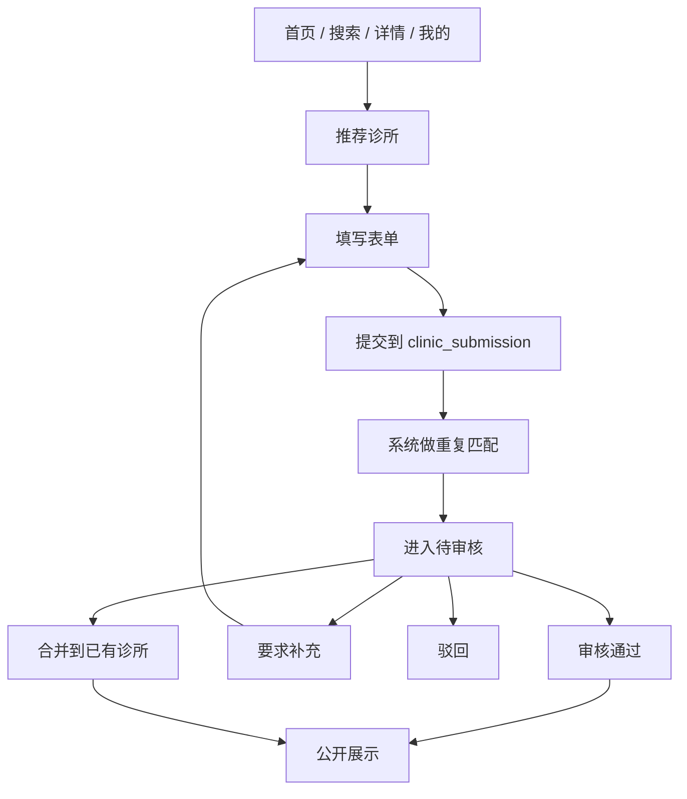
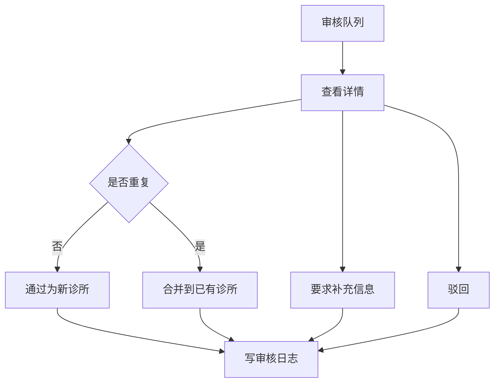
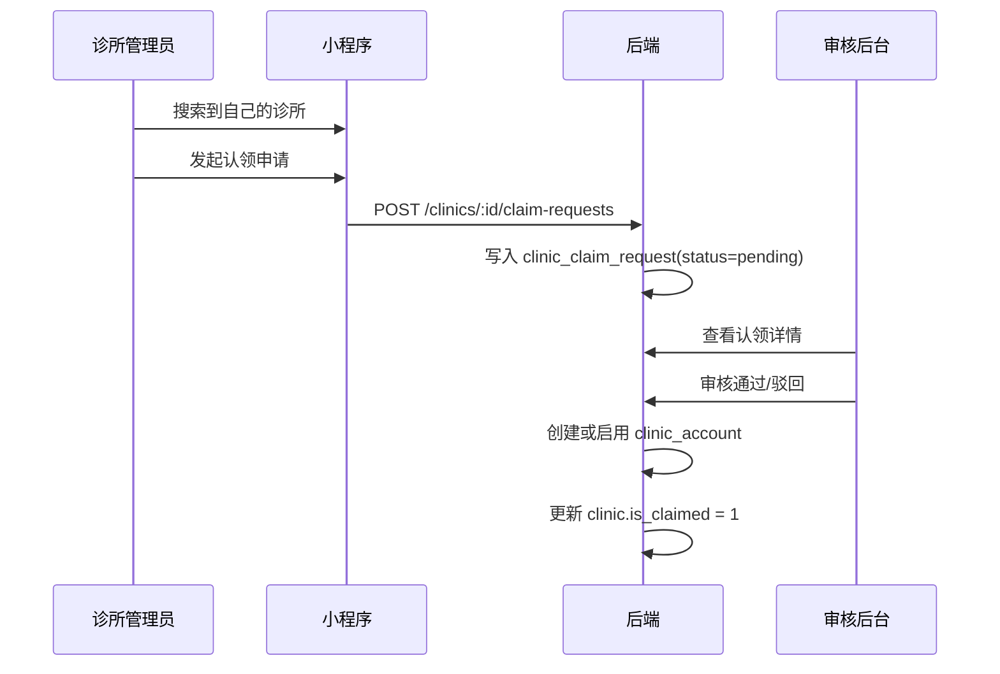

# 诊所收录与入驻双链路设计稿

> 目标：补齐冷启动诊所收录、用户推荐、后台审核、诊所自助认领四个环节，形成可落地闭环。
> 范围：只定义流程、页面、状态和数据模型，不展开具体实现代码。

---

## 1. 结论先行

这件事要拆成两条链路：

1. 用户推荐链路，解决“库里没有这家诊所怎么办”。
2. 诊所入驻链路，解决“诊所怎么自己来接管并更新信息”。

审核必须独立于小程序，放到后台系统里。小程序负责提交和查看进度，后台负责比对、合并、通过、驳回。

---

## 2. 现有底座

当前仓库已经有一部分基础能力，可以直接复用：

- `backend/src/database/entities/clinic.entity.ts` 已经有 `isClaimed`、`clinicAccount`、`clinicClaimRequests` 关系。
- `backend/src/database/entities/clinic-account.entity.ts` 已经存在诊所后台账号模型。
- `backend/src/database/entities/clinic-claim-request.entity.ts` 已经存在认领申请模型。
- `backend/src/database/migrations/CreateClinicClaimAndMessagingTables202605110006.ts` 已经落了 `clinic_account`、`clinic_claim_request`、`message_task`。
- `backend/src/modules/auth/auth.controller.ts` 已有 `POST /auth/dev-token`，可支撑开发态诊所账号测试。
- `backend/src/modules/clinics/clinics.controller.ts` 已有 `POST /clinics/:id/responses`，说明“认领后回应”这条链路已部分成立。

当前缺口也很明确：

- 小程序没有“推荐诊所”入口页。
- 没有“我的推荐”状态页。
- 没有审核后台。
- 没有用户推荐提交表。
- 没有推荐审核日志表。

---

## 3. 角色

- 普通用户，提交推荐、纠错、补充信息。
- 审核员，处理新增、合并、驳回、补充信息。
- 诊所管理员，认领已有诊所并维护资料。
- 系统，做去重、候选匹配、状态推进。

---

## 4. 用户推荐链路

### 4.1 入口

推荐入口只放在低频位置，不占主 Tab：

- 首页空态
- 搜索无结果页
- 诊所详情页
- 我的页面

建议新增小程序页：

- `pages/recommend-clinic/recommend-clinic`
- `pages/my-submissions/my-submissions`

### 4.2 用户可选操作

用户提交时只做三类事：

1. 推荐新诊所。
2. 补充已有诊所信息。
3. 纠错，指出已有信息有问题。

### 4.3 表单最小字段

- 诊所名称
- 地址
- 定位点
- 电话
- 营业时间
- 诊所照片
- 推荐理由
- 联系方式，选填

图片存储策略：

- 小程序先单独上传图片，再把返回的 URL 写入 `clinic_submission.photos_json`。
- 当前阶段默认使用服务端本地目录 `uploads/clinic-submissions/`。
- 后续如果切对象存储，只替换上传实现，不改推荐提交接口。

### 4.4 用户可见状态

- 待审核
- 需补充
- 已通过
- 已合并
- 已驳回

### 4.5 用户推荐流程图



---

## 5. 后台审核链路

### 5.1 入口

审核必须是独立后台，不放进小程序。建议做成 PC/H5 后台：

- `/admin/login`
- `/admin/review/clinic-submissions`
- `/admin/review/clinic-claims`

### 5.2 审核列表需要看什么

- 提交类型
- 提交时间
- 城市/区域
- 候选重复诊所
- 当前状态
- 提交人
- 审核人

### 5.3 审核详情需要看什么

- 用户提交内容
- 系统匹配出的候选诊所
- 地图位置
- 历史重复提交
- 审核备注

### 5.4 审核动作

1. 通过为新诊所。
2. 合并到已有诊所。
3. 要求补充信息。
4. 驳回。

### 5.5 审核流程图



---

## 6. 诊所认领链路

认领不是推荐。认领是“这家诊所已经在库里，诊所自己来接管”。

### 6.1 入口

- 诊所搜索自己的名称
- 诊所详情页点击“我是这家诊所，申请认领”

### 6.2 认领材料

- 诊所名称
- 联系人
- 联系电话
- 营业执照或门头证明
- 可选补充材料

### 6.3 认领流程



### 6.4 认领后权限

通过后只开放这几项：

- 查看诊所基础信息
- 修改受控字段
- 提交标签回应
- 查看认领状态和审核记录

不开放：

- 删除用户评价
- 修改用户打分结果
- 绕过审核直接改主排序

---

## 7. 数据模型

### 7.1 复用现有表

- `clinic`
- `clinic_account`
- `clinic_claim_request`
- `message_task`

### 7.2 新增建议表

#### `clinic_submission`

用户推荐和纠错主表。

字段建议：

- `id`
- `submitter_user_id`
- `submission_type`
- `clinic_id`，可空，命中已有诊所时回填
- `name`
- `address`
- `lat`
- `lng`
- `phone`
- `business_hours`
- `photos_json`
- `reason`
- `status`
- `matched_clinic_id`
- `reviewed_by`
- `reviewed_at`
- `review_note`
- `created_at`
- `updated_at`

#### `clinic_submission_review_log`

审核日志表，记录每次动作。

字段建议：

- `id`
- `submission_id`
- `reviewer_id`
- `action`
- `before_status`
- `after_status`
- `note`
- `created_at`

#### `admin_user`

后台审核身份表，后续补进来。

---

## 8. 状态机

### 8.1 推荐单状态

```text
draft -> pending_review -> need_info -> pending_review -> approved_new
                                   -> merged
                                   -> rejected
```

### 8.2 认领单状态

```text
pending -> approved -> rejected
```

### 8.3 诊所主状态

- `is_claimed = 0`，未认领
- `is_claimed = 1`，已认领

---

## 9. 页面地图

### 小程序

- 首页，新增“推荐诊所”空态入口。
- 搜索页，新增“找不到，推荐一家”。
- 诊所详情页，新增“信息有误 / 我要补充”。
- 我的页，新增“我的推荐”。
- 新增推荐页 `pages/recommend-clinic/recommend-clinic`。
- 新增提交记录页 `pages/my-submissions/my-submissions`。

### 后台

- 审核列表页
- 审核详情页
- 认领审核页
- 审核日志页

---

## 10. 风险控制

- 去重必须先做，不然库会被重复诊所淹没。
- 任何用户推荐都必须进审核池，不允许直接上线。
- 任何诊所认领都必须留审核日志。
- 审核后台必须和用户小程序分离。
- 公开列表只读，不能让前台自己改主数据。

---

## 11. 不在本版范围

- 自动化工商/地图全量抓取。
- 证照 OCR 自动审核。
- 诊所多账号体系。
- 复杂工单流转。
- 推荐奖励体系。

---

## 12. 实施顺序

1. 先加 `clinic_submission` 和审核日志。
2. 再补用户推荐页和我的推荐页。
3. 再补后台审核页。
4. 最后接入认领页和认领审核页。

---

## 13. 配套产物

- [实施任务清单](./诊所收录与入驻实施任务清单.md)
- [API 清单](./诊所收录与入驻API清单.md)
